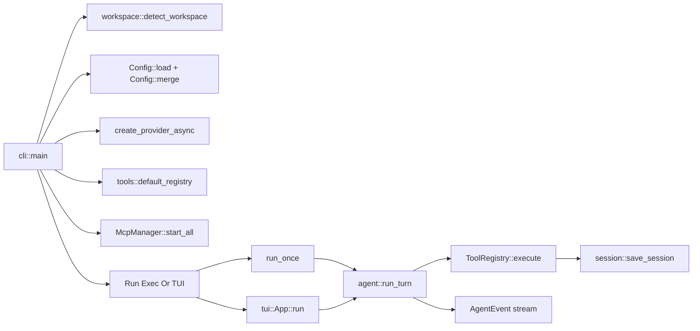

# Architecture

Source of truth:

- `crates/cli/src/main.rs`
- `crates/core/src/agent/mod.rs`
- `crates/core/src/tools/mod.rs`
- `crates/core/src/agent_manager.rs`
- `crates/core/src/context_briefing.rs`
- `crates/core/src/workspace/mod.rs`
- `crates/tui/src/app.rs`

## Workspace Layout

| Crate | Responsibility |
| --- | --- |
| `crates/cli` | CLI entrypoint, command dispatch, runtime wiring |
| `crates/core` | agent runtime, tools, sessions, MCP, teams, hooks, memory |
| `crates/provider` | provider abstraction, model registry, streaming adapters |
| `crates/auth` | API key/OAuth/token resolution and rotation |
| `crates/config` | config schema/defaults/merge rules |
| `crates/tui` | terminal UI, slash commands, event loop, selectors |
| `crates/index` | semantic index, embeddings, auto-context retrieval |

## High-level Runtime Graph

## Startup Sequence

1. Parse CLI arguments.
2. Load global config.
3. Detect workspace root and rules source.
4. If project config exists, merge with global config.
5. Create provider (or defer when credentials unavailable).
6. Build tool registry (`default_registry`), then register MCP tools.
7. Dispatch to:
   - `run`/`exec` (`run_once`)
   - TUI app (`App::run`)

## Turn Execution Flow

Core turn execution is driven by `agent::run_turn` / `run_turn_with_content`.

Per turn:

1. Prepare system prompt from workspace rules + custom instructions + MCP summaries.
2. Inject memory (`memory::load_memory_for_prompt`) when enabled.
3. Add optional auto-context from semantic index when enabled.
4. Stream model response.
5. Execute tool calls with permission checks.
6. Emit `AgentEvent` updates for UI/CLI.
7. Persist session unless ephemeral.

## Tool Execution Boundaries

Tool execution gates:

- role filtering (`allowed_tool_names`)
- trust policy
- sandbox level
- explicit approval workflow for `NeedsApproval` tools

Concurrency:

- read-only tool calls may execute in parallel
- mutating calls execute sequentially

## Subagent Architecture

Subagents are managed by `AgentManager` (interactive runtime).

Lifecycle tools:

- `spawn_agent`
- `send_input`
- `wait`
- `close_agent`
- `resume_agent`

Statuses (`AgentStatus`):

- `pending_init`
- `running`
- `completed`
- `errored`
- `shutdown`
- `not_found`

Manager limits:

- `max_threads`
- `max_depth`

## Subagent Context Briefing

Before spawn, parent context can inject a briefing from `SharedContext`:

- recent file changes
- active todos
- conversation summary
- project memory excerpt

Caps:

- `MAX_BRIEFING_LINES = 60`
- `MAX_CHANGE_ENTRIES = 20`
- `MAX_MESSAGE_PREVIEW = 5`

## Team Collaboration Model

Team artifacts are backed by filesystem state:

- team config JSON
- per-member inbox files
- shared taskboard files

Team-aware fields in `ToolContext`:

- `team_name`
- `agent_name`
- `is_team_lead`

This drives tools such as `send_team_message`, `read_inbox`, and `spawn_teammate`.

## Workspace and Rule Resolution

Workspace detection prioritizes:

1. `.nyzhi/`
2. `.claude/`
3. `.cursorrules`
4. `.git`

Primary rule file priority:

1. `AGENTS.md`
2. `.nyzhi/rules.md`
3. `.nyzhi/instructions.md`
4. `CLAUDE.md`
5. `.cursorrules`

Additional local preferences:

- `NYZHI.local.md`
- `.nyzhi/local.md`

Modular rules under `.nyzhi/rules/*.md` can be unconditional or path-conditional (`paths:` frontmatter).

## Persistence Overview

| Domain | Location |
| --- | --- |
| Sessions | `<data_dir>/sessions/*.json` |
| Memory | `<data_dir>/projects/<hash>/memory/` and `~/.nyzhi/MEMORY.md` |
| Team configs | `~/.nyzhi/teams/<team>/config.json` |
| Team inboxes | `~/.nyzhi/teams/<team>/inboxes/*.json` |
| Team tasks | `~/.nyzhi/tasks/<team>/` |
| Autopilot state | `<project>/.nyzhi/state/autopilot.json` |
| Tool context offloads | `<project>/.nyzhi/context/` |

## Design Principles

- terminal-first UX with non-interactive parity
- strict safety boundaries (trust + sandbox + approvals)
- provider-agnostic runtime with explicit metadata
- transparent state via files and replayable sessions
- composable agent model (main agent, subagents, teammate mesh)

Related internals:

- `docs/internals/subagent-lifecycle.md`
- `docs/internals/workspace-rules.md`
- `docs/internals/roles-and-briefing.md`
